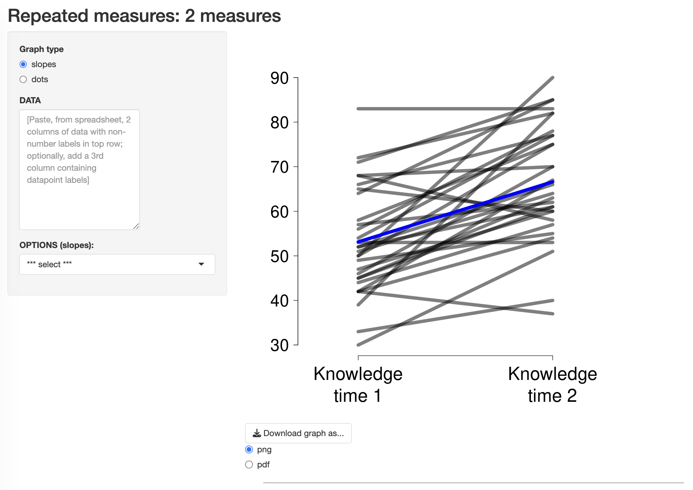

# ShowMyData: Repeated Measures – 2 Measures



**ShowMyData** is a collection of free, open-source Shiny applications for creating publication-quality data visualizations. Simply copy and paste your data, adjust a few options, and produce elegant graphs suitable for exploration, presentation, or publication.

ShowMyData is built around a simple but surprisingly uncommon design principle: **show the data**.

This application creates publication-quality graphs for paired or repeated-measures data involving two measurements per participant. It emphasizes individual trajectories and within-subject change while preserving access to every observation.

---

## Launch the app

**https://showmydata.org**

---

## Run locally

```r
install.packages(c(
  "shiny",
  "stringr",
  "tidyr",
  "readr",
  "gsheet",
  "mvtnorm",
  "psych",
  "sadists",
  "colourpicker",
  "rclipboard"
))
```

```r
shiny::runGitHub(
  repo = "smd_onerepeat",
  username = "ShowMyData",
  subdir = "onerepeat"
)
```

---

## Download the source code

To download the source code from GitHub:

1. Click the green **Code** button near the top of this repository.
2. Choose **Download ZIP**.
3. Unzip the downloaded folder.

---

## About ShowMyData

ShowMyData is an open-source collection of interactive Shiny applications that make it easy to create elegant, data-rich visualizations for research, teaching, and publication. Our guiding principle is simple: **show the data**. By making individual observations visible whenever practical, the apps help viewers see what is really present in the data.

Learn more at:

**https://showmydata.org**

---

## Citation

If you use this software in research or teaching, please cite:

> Wilmer, J. B. (2022). *Data Visualization Web Apps* (Version 2.0) [Web Apps]. ShowMyData. https://showmydata.org

---

## License

This software is licensed under the GNU Affero General Public License v3.0 (AGPL-3.0).

---

## Feedback

Bug reports, feature requests, and contributions are welcome through the GitHub Issues page.

---


